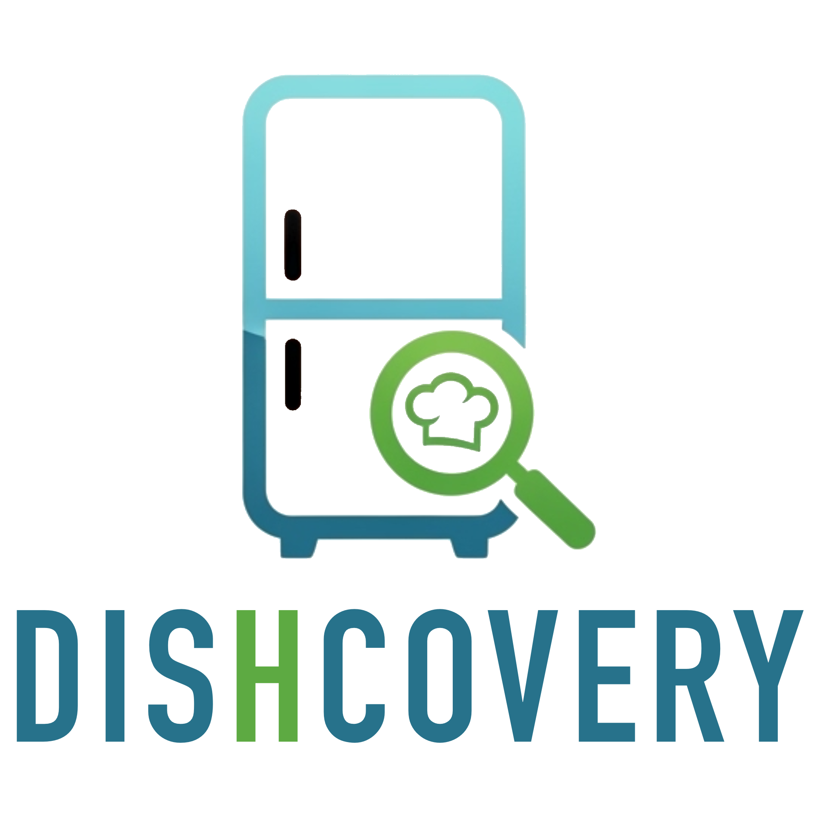

# Dishcovery

<p align="center">
  
</p>

## Susanna Peretti mat. 329456

## Overview

## User Experience

## Dependencies
- uuid, for generating unique identifiers for dishes
- http, for handling HTTP requests
- flutter_riverpod

# Structure
```
lib/
  ├── main.dart
  ├── models/
    ├── dish.dart
  ├── pages/
    ├── home_page.dart
    ├── dish_detail_page.dart
  └── widgets/
```

