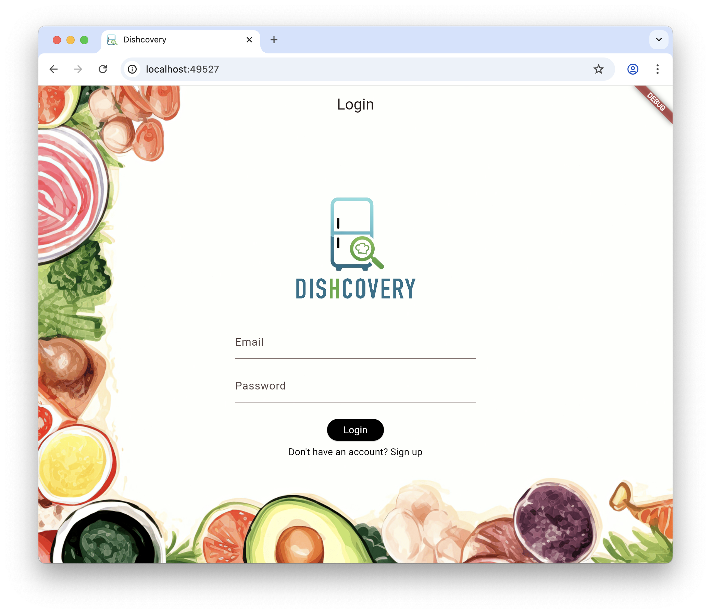
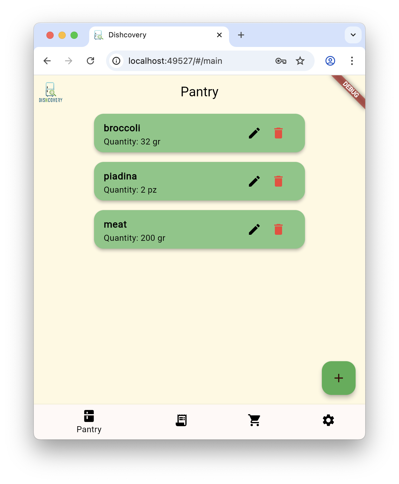
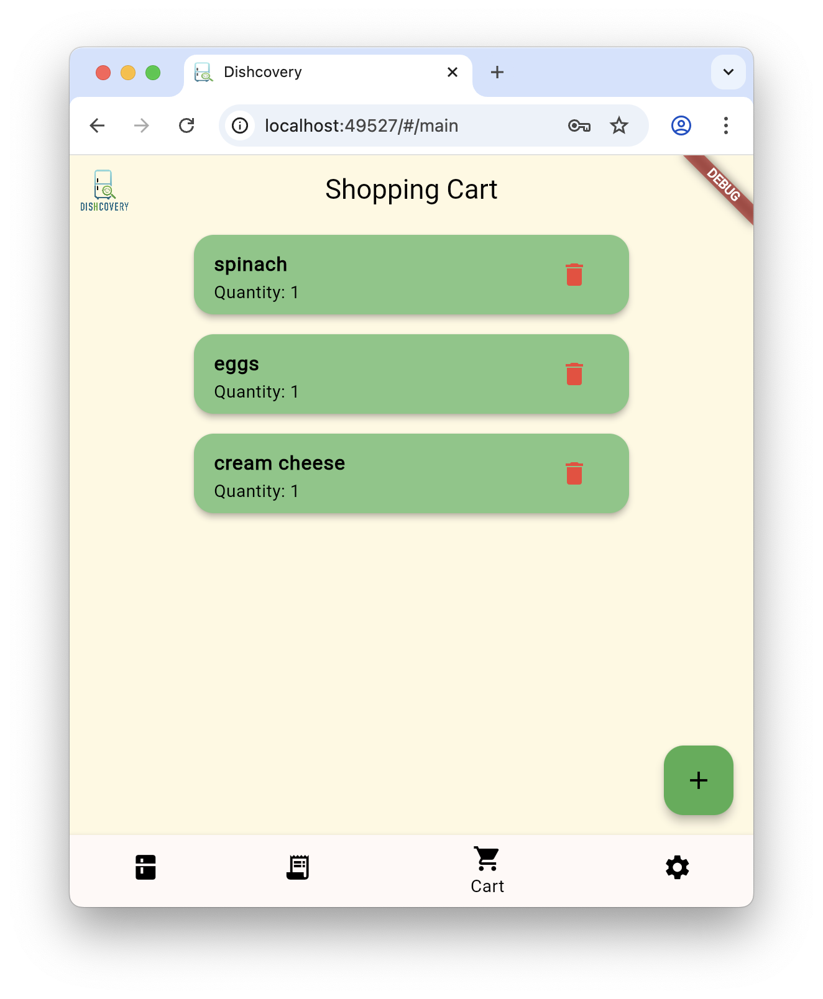
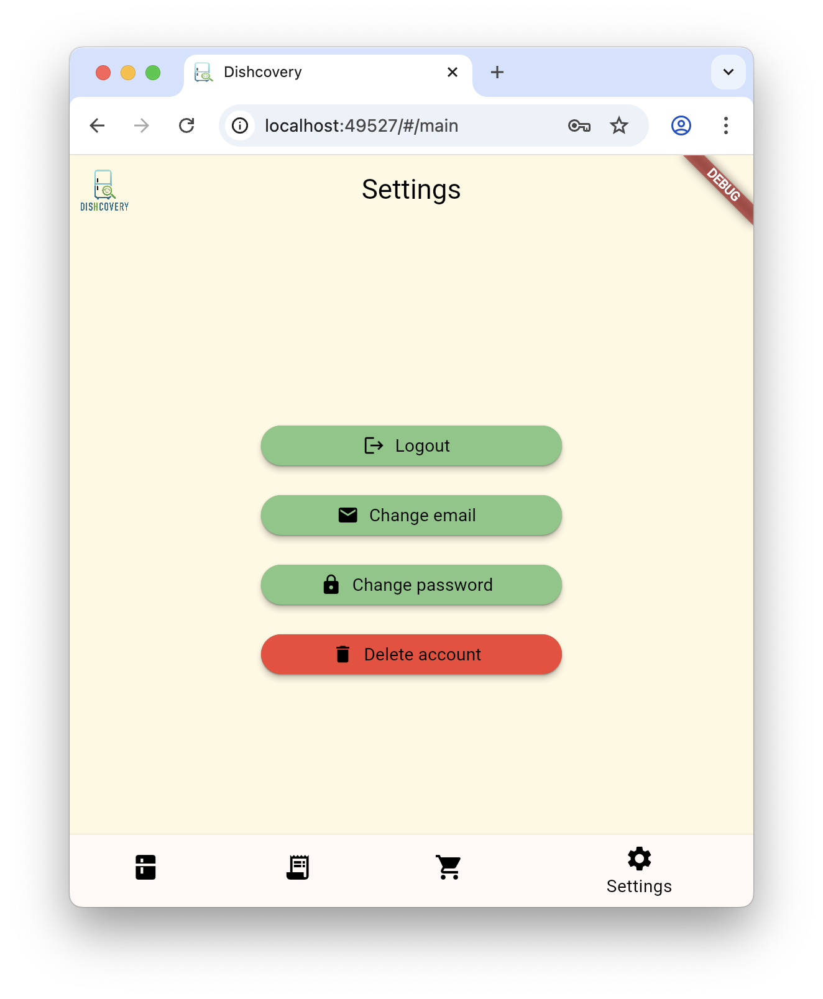
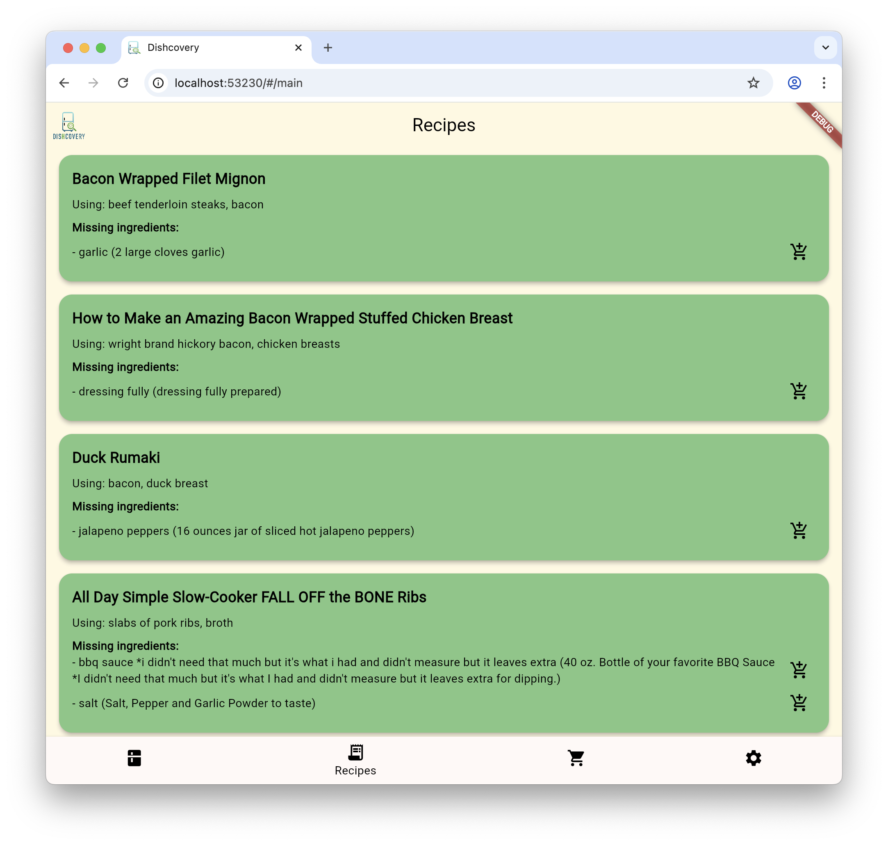

# Dishcovery

<p align="center">
  
</p>

## Susanna Peretti mat. 329456

## Descrizione del progetto
Dishcovery è un'applicazione Flutter che permette agli utenti di scoprire nuove ricette in base agli ingredienti disponibili nella loro dispensa, inseriti manualmente. L'app consente di creare un account, gestire la dispensa personale, esplorare ricette suggerite, e aggiungere ingredienti al carrello per creare una lista della spesa.

## User Experience
L'utente accederà all'applicativo tramite l'inserimento di email e password. Se non è registrato, potrà creare un nuovo account. E' richiesto un indirizzo mail valido e una password di almeno 6 caratteri.

<p align="center">
  
  
</p>

Una volta autenticato, l'utente verrà indirizzato alla schermata principale dell'app, che include una barra di navigazione inferiore per accedere alle diverse sezioni: Dispensa, Ricette, Carrello e Impostazioni. La dispensa consente di aggiungere ingredienti manualmente, visualizzare quelli esistenti e rimuoverli. Gli ingredienti delle ricette possono essere aggiunti e visualizzati nel carrello per creare una lista della spesa. La sezione Impostazioni permette di modificare le informazioni dell'account o cancellarlo.

<p align="center">
  
  
  
</p>

### Spoonacular API
L'API [Spoonacular API](https://spoonacular.com/food-api) consente di accedere a migliaia di ricette, migliaia di ingredienti, 800.000 prodotti alimentari e 100.000 voci di menu. Per questo progetto, l'API viene utilizzata per cercare ricette in base agli ingredienti disponibili nella dispensa dell'utente. Quando l'utente accede alla sezione Ricette, l'app invia una richiesta all'API con gli ingredienti presenti nella dispensa. L'API restituisce un elenco di ricette che possono essere preparate con quegli ingredienti, insieme a informazioni come il titolo della ricetta, gli ingredienti necessari e quelli mancanti.

<p align="center">
  
</p>

## Gestione dello stato
- **Hive**: Utilizzato come database locale NoSQL per la persistenza dei dati. I dati vengono salvati in box separati (ad esempio 'users', 'ingredients', 'cart'), e ogni operazione di aggiunta, modifica o cancellazione aggiorna direttamente il box corrispondente.
- **ValueListenableBuilder**: Questo widget permette di ascoltare i cambiamenti nei box Hive e aggiornare automaticamente la UI quando i dati cambiano. Ad esempio, la lista degli ingredienti nella dispensa viene aggiornata in tempo reale ogni volta che un ingrediente viene aggiunto o rimosso, senza necessità di refresh manuale.
- **setState**: Utilizzato per gestire lo stato locale dei widget e triggerare il rebuild della UI dopo operazioni che non sono direttamente collegate a Hive (ad esempio, dopo la chiusura di un dialog di aggiunta/modifica, o per mostrare messaggi di feedback). setState viene chiamato per aggiornare variabili locali e garantire che la UI rifletta lo stato corrente dell'applicazione.
- **Relazione tra dati**: La UI è completamente reattiva rispetto ai dati Hive. Ogni utente vede solo i propri ingredienti e carrello, grazie al campo `ownerEmail` associato ad ogni oggetto Ingredient. La persistenza è garantita anche tra sessioni diverse: al login viene salvata l'email dell'utente corrente in un box di sessione, e tutte le query sui dati filtrano per quell'email.

## Dipendenze
- **flutter** SDK 3.8.1
- **hive** database locale chiave-valore
- **http**: per richieste API

### Struttura del progetto
```
lib/
  ├── main.dart
  ├── models/
    ├── ingredients.dart
    ├── ingredient.g.dart
    ├── user.dart
    ├── muser.g.dart
  ├── pages/
    ├── cart_page.dart
    ├── login_page.dart
    ├── main_app_page.dart
    ├── pantry_page.dart
    ├── recipes_page.dart
    ├── settings_page.dart
    ├── sign_up_page.dart
  ├── services/
    ├── spoonacular_api.dart
  '''